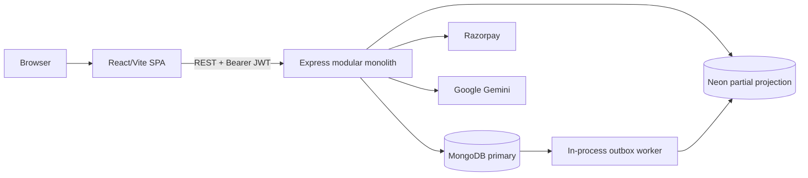

# Ghar Nishchit

## 1. Project Overview
Ghar Nishchit is a full-stack rental-management application for tenants, landlords, and administrators. It combines property discovery, enquiries, visits, contracts, maintenance, notifications, support, and Razorpay payments in a React frontend and Express modular monolith.

## 2. Problem Being Solved
Rental workflows are fragmented across listing sites, messaging, documents, maintenance calls, and payment records. This project puts those workflows behind role-specific dashboards.

## 3. Functional Requirements
- Tenants register, browse/favourite properties, contact landlords, schedule visits, review contracts, request maintenance, and pay.
- Landlords manage properties, enquiries, contracts, tenants, maintenance, and subscriptions.
- Administrators review users, properties, contracts, maintenance, payments, support, and broadcasts.

## 4. Non-Functional Requirements
Current priorities are access control, validation, responsive UI, payment integrity, and recoverable data synchronization. Formal SLOs, capacity targets, and recovery objectives are **Not currently implemented**.

## 5. Tech Stack
- React 19, Vite 8, React Router, TanStack Query, Tailwind, Recharts, Framer Motion.
- Node.js, Express 5, Mongoose, Zod, JWT, bcryptjs.
- MongoDB primary; Neon/PostgreSQL partial secondary projection.
- Razorpay and server-side Google Gemini integration.
- Playwright smoke tests; backend automated tests are **Not currently implemented**.

## 6. High-Level System Architecture
The current system is a frontend/backend modular monolith. MongoDB is authoritative. Selected records are copied to Neon using direct writes or a MongoDB outbox worker.

## 7. Architecture Diagram


## 8. Request/Data Flow
Login validates a MongoDB password hash and returns JWTs. Protected requests verify the token, reload the current user, enforce account status, and enforce role. Controllers read/write MongoDB; selected writes are mirrored to Neon. Razorpay signatures are checked before payment confirmation.

## 9. Database Design
MongoDB collections cover users, properties, favourites, enquiries, visits, contracts, maintenance, payments, landlord payments, notifications, support, and outbox jobs. Embedded replies/history suit document retrieval; references model ownership. Neon contains incomplete projections and is not the authentication source.

## 10. API Architecture
REST groups under `/api` include auth, users, properties, favourites, tenants, maintenance, inquiries, notifications, payments, landlord-payments, visits, contracts, support, admin, and AI. REST matches the resource-oriented workflows. Versioning and OpenAPI are **Not currently implemented**.

## 11. Authentication & Authorization Flow
Public signup permits tenant/landlord roles. Admins are provisioned by script. Access tokens last one hour and refresh tokens 72 hours. Protected requests reload the MongoDB user and reject suspended/banned accounts. Backend RBAC is authoritative. Tokens remain in `localStorage`, an acknowledged XSS trade-off.

## 12. Important Engineering Decisions
- Modular monolith: low operational cost while domains stay separated by routes/controllers/models.
- MongoDB primary: the implementation and nested maintenance/message structures were built around Mongoose; Neon is not falsely presented as authoritative.
- REST: simple fit for CRUD workflows and browser/tool clients.
- JWT plus user lookup: current status/role changes apply before token expiry.
- Contract outbox: isolates the primary write from Neon availability, within the limits of an in-process worker.
- TanStack Query: server-state caching without a larger global-state framework.

## 13. Alternatives Considered
PostgreSQL-only storage offers stronger relational integrity but needs a deliberate migration. Cookie sessions improve token protection but require session storage and CSRF controls. Microservices/brokers add unjustified operational cost at current scale. Direct browser Gemini was removed because it exposed the key.

## 14. Trade-offs
The monolith is easy to run but scales workloads together. MongoDB supports evolving documents but relationships rely on application logic. JWTs reduce session state but localStorage increases XSS impact. Dual persistence introduces consistency risk.

## 15. Security Considerations
Implemented: bcrypt, server-side RBAC/ownership checks, account-status enforcement, auth validation, CORS allowlist, 2 MB body limits, rate limiting, and Razorpay HMAC checks. Refresh rotation, HttpOnly cookies, Helmet/CSP, distributed limiting, comprehensive schemas, a secrets manager, and security tests are **Not currently implemented**. See [Security](docs/SECURITY.md).

## 16. Error Handling & Reliability
The API has global structured error handling, JSON 404s, signature checks, and a retrying contract outbox. Error shapes still vary, direct Neon writes can diverge, and graceful shutdown/dead-letter recovery are **Not currently implemented**.

## 17. Performance Considerations
Lazy routes and vendor chunks reduce frontend work. Indexes cover geolocation and selected maintenance/payment paths. Risks include unpaginated lists, in-memory admin analytics, N+1 payment filtering, and large embedded documents. See [Performance](docs/PERFORMANCE.md).

## 18. Current Bottlenecks
- Admin dashboard loads complete collections.
- Several list endpoints lack pagination.
- Landlord payment filtering queries inside loops.
- HTTP and outbox work share one Node process.
- Cross-database writes lack full reconciliation.

## 19. Scalability Strategy
Add pagination, database aggregation, query measurement, compound indexes, structured telemetry, and a separately runnable worker first. Add API replicas, load balancing, and shared caching/rate limiting only after measurements justify them.

## 20. Production Readiness
This is suitable for development and case-study use, not asserted production readiness. Deployment manifests, CI/CD, backups, monitoring, graceful shutdown, migration automation, and recovery tests are **Not currently implemented**. See [Production Readiness](docs/PRODUCTION_READINESS.md).

## 21. Known Limitations
- Incomplete MongoDB/Neon synchronization.
- No backend test suite or API contract.
- LocalStorage refresh tokens are not rotated/revoked.
- Firebase login was removed because backend identity exchange was incomplete.
- Payment price derivation/idempotency require more work.
- No measured benchmarks.

## 22. Future Architecture
Keep the modular monolith until measured load requires stateless API replicas, a separately deployed worker, shared limiter/cache, managed backups, object storage, centralized telemetry, and CDN-hosted static assets. These are proposals, not current capabilities.

## 23. How to Run Locally
```powershell
cd backend
Copy-Item .env.example .env -ErrorAction Stop # only when .env does not exist
# Configure MongoDB and secrets
npm install
npm run create-admin # optional
npm run dev
```
```powershell
cd frontend/UI
npm install
npm run dev
```
Frontend: `http://localhost:5173`; backend: `http://localhost:5000`. Never commit `.env` files.

## 24. Interview Questions & Answers
See [Interview Questions](docs/INTERVIEW_QUESTIONS.md) for 30 repository-specific questions.

## Engineering Documents
- [System Design](docs/SYSTEM_DESIGN.md)
- [Engineering Decisions](docs/ENGINEERING_DECISIONS.md)
- [Performance](docs/PERFORMANCE.md)
- [Security](docs/SECURITY.md)
- [Interview Questions](docs/INTERVIEW_QUESTIONS.md)
- [Production Readiness](docs/PRODUCTION_READINESS.md)
